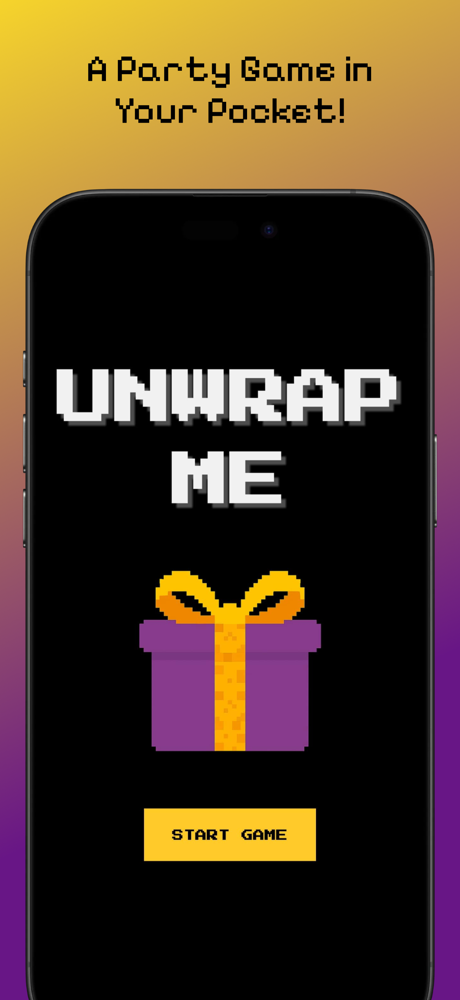
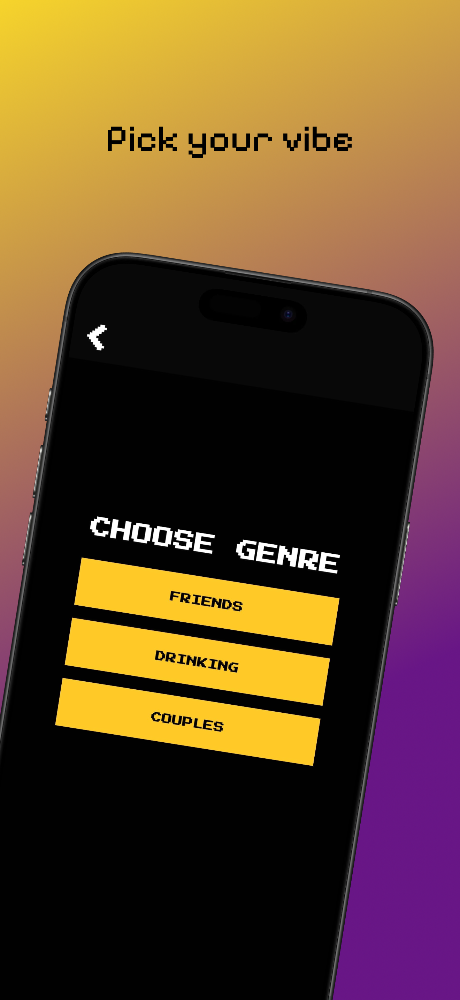
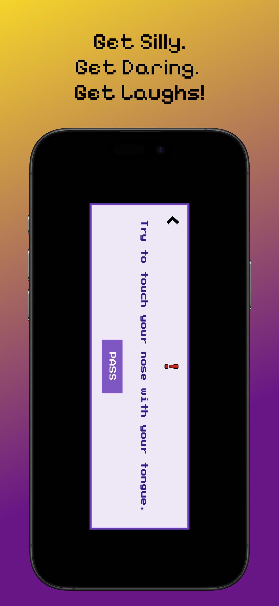

<p align="center">
  
</p>

# 🎁 UnWrap Me

**UnWrap the Wrap** is a fun, AI-powered party game inspired by the classic **Pass the Parcel**.  
Every time the music stops, a new surprise question is unwrapped for players to answer!  
Built using Flutter and powered by OpenAI's GPT API.

---

## 📱 Features

- Classic Pass the Parcel style gameplay
- Random fun or personal questions generated by AI
- Great for groups, parties, and families
- No user input required
- Clean and simple UI

---

## 📷 Screenshots

<!-- Add screenshots in the `assets/screenshots/` folder -->
<p align="center">
  
  
  
</p>

---

## 🔐 Privacy Policy

We respect your privacy. The app does **not** collect, store, or share any personal data.  
We use OpenAI’s API to generate fun prompts, but no user data is ever sent or processed.


---

## 🚀 Getting Started (Developers)

This project is a starting point for a Flutter application.

To get started:

```bash
git clone https://github.com/yourusername/moving_box.git
cd moving_box
flutter pub get
flutter run
